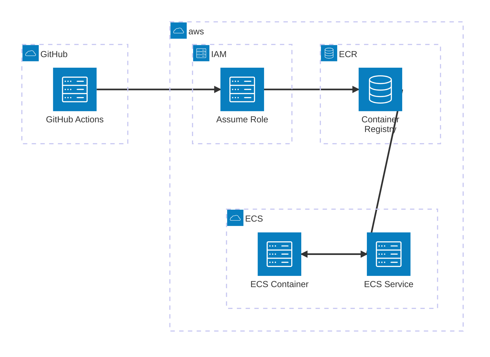

# litestar_project

## Overview

litestar_project is a template project built using the [Litestar](https://www.litestar.dev) framework and [Pydantic](https://pydantic-docs.helpmanual.io). It is designed to kickstart development of scalable and performant web applications.

## Project Structure

The repository is organized as follows:

- **src/litestar_project/**: Contains the main application code.
- **src/scripts/**: Contains utility scripts, including a test runner (invoked as described below).

Other important files include:

- **.gitignore**: Specifies files and directories to ignore in version control.
- **.python-version**: Specifies the required Python version (3.12).
- **pyproject.toml**: Contains project configuration, dependencies, and build settings.
- **uv.lock**: Lock file with exact dependency versions.

## Requirements

- Python 3.12 or higher
- Dependencies managed via Hatchling, as specified in [pyproject.toml](pyproject.toml)
- UV as a package manager, as specified in [pyproject.toml](pyproject.toml)

## Getting Started

### Setup

- Install uv via Homebrew:
  ```bash
  brew install uv
  ```

- Sync dependencies:
  ```bash
  uv sync
  ```

### Run the server
  ```bash
  uv run server
  ```

### Test
  ```bash
  uv test --mypy --ruff --pytest
  ```

## Deployment Architecture

The project uses AWS ECS for container orchestration with a GitHub Actions-based CI/CD pipeline. Here's the deployment flow:



### CI/CD Process

When a manual release is triggered:

1. GitHub Actions workflow is initiated
2. Workflow assumes an IAM role in AWS
3. Container image is built and pushed to ECR
4. ECS service is updated with the new container image
5. ECS deploys the new container
